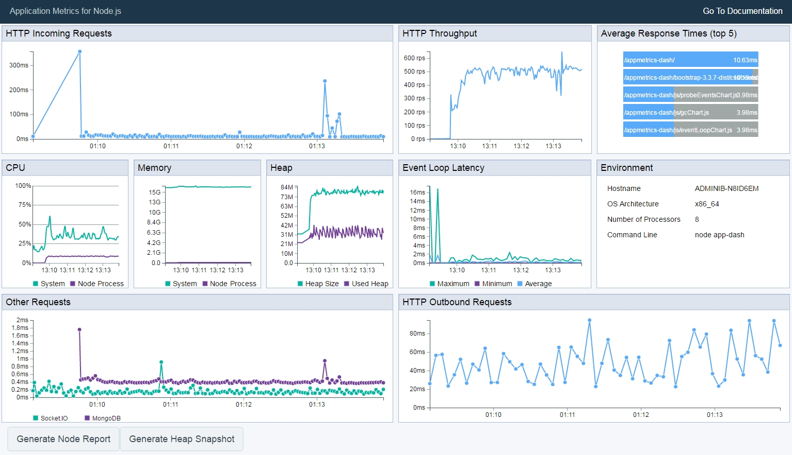
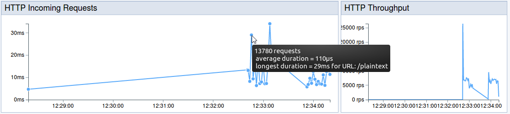

---

copyright:
  years: 2018
lastupdated: "2018-09-19"

---

{:new_window: target="_blank"}
{:shortdesc: .shortdesc}
{:screen: .screen}
{:codeblock: .codeblock}
{:pre: .pre}
{:tip: .tip}

# Utilización de métricas de aplicación con apps Node.js
{: #metrics}

Obtenga información sobre cómo instalar, acceder y comprender las métricas de la aplicación Node.js. Puede supervisar las apps de Node.js con el panel de control de [Node Application Metrics](https://developer.ibm.com/code/open/projects/node-application-metrics/) para visualizar el rendimiento de la aplicación Node.js visualizando métricas en un frontal basado en web.
{: shortdesc}

## Identificación visual de problemas
{: #identify-problems}

Las métricas de aplicación son importantes para supervisar el rendimiento de la aplicación. Tener una vista en directo de métricas como CPU, memoria, latencia y métricas HTTP es esencial para asegurarse de que la aplicación se ejecuta de forma efectiva a lo largo del tiempo. Puede utilizar un servicio de nube como el [escalado automático](/docs/services/Auto-Scaling/index.html) de Cloud Foundry, que se basa en métricas para escalar dinámicamente las instancias para que coincidan con la carga de trabajo actual. Con el uso de métricas de aplicación, estará informado forma precisa para saber cuando se deben aumentar, reducir o borrar las instancias que ya no se necesitan para mantener los costes bajos.

Las métricas de aplicación se capturan como datos de serie temporal. La agregación y visualización de métricas capturadas puede ayudar a identificar problemas de rendimiento comunes como, por ejemplo:

* Tiempos de respuesta HTTP lentos en algunas o en todas las rutas
* Rendimiento bajo en la aplicación
* Aumentos considerables en la demanda que provocan la desaceleración
* Uso de CPU mayor del esperado
* Uso de memoria alto o creciente (fuga de memoria potencial)

El panel de control de métricas de aplicación incorporado ([ `appmetrics-dash`](https://github.com/RuntimeTools/appmetrics-dash)) también incluye un diagrama para 'Otras solicitudes', que muestra la duración de la solicitud de base de datos para bases de datos soportadas (MongoDB, MySQL, Postgres, LevelDB, y Redis), Socket.IO y Sucesos de Riak.

Desde el panel de control, se puede generar un informe de nodo o una instantánea de almacenamiento dinámico para conseguir un análisis más detallado.

## Adición de métricas a apps Node.js existentes
{: #add-appmetrics-existing}

Añada características de supervisión a las aplicaciones Express existentes con el constructor [`appmetrics-dash`](https://github.com/RuntimeTools/appmetrics-dash) para pasar en una serie de opciones de configuración. Por ejemplo, una de las opciones utiliza un servidor existente en lugar que `appmetrics-dash` inicie un servidor adicional.

### Instalación del panel de control

1. Por ejemplo, utilice la siguiente aplicación express "Hello World" sencilla:
  ```js
  var express = require('express')
  var app = express()
  app.get('/', function (req, res) {
      res.send('Hello World!')
  })
  app.listen(3000, function () {
      console.log('Example app listening on port 3000!')
  })
  ```
  {: codeblock}

2. Instale el panel de control `appmetrics` con el siguiente mandato [npm](https://nodejs.org/):
  ```
  npm install appmetrics-dash
  ```
  {: codeblock}

3. Añada el soporte de `appmetrics-dash` a la app existente añadiendo el código siguiente:
  ```js
  var dash = require('appmetrics-dash').attach()
  ```
  {: codeblock}

  Este mandato indica a `appmetrics-dash` que utilice el servidor que ya se ha creado y que añada un punto final `appmetrics-dash`.

  Ahora, el código revisado es similar al siguiente ejemplo:
  ```js
  var express = require('express')
  var app = express()
  var dash = require('appmetrics-dash').attach()
  app.get('/', function (req, res) {
    res.send('Hello World!')
  })
  app.listen(3000, function () {
    console.log('Example app listening on port 3000!')
  })
  ```
  {: codeblock}

## Utilización de métricas desde Kits de iniciación
{: #appmetrics-starterkits}

Las aplicaciones Node.js que se crean desde Kits de iniciación incluyen automáticamente `appmetrics-dash` y su panel de control de forma predeterminada, pero se deben habilitar para su uso.

El código completo de appmetrics se puede encontrar en el archivo de origen de la aplicación generado, denominado `/app_name/server/server.js`:
```js
// Uncomment following to enable zipkin tracing, tailor to fit your network configuration:
var appzip = require('appmetrics-zipkin')({
    host: 'localhost',
    port: 9411,
    serviceName:'frontend'
});
```
{: codeblock}

## Acceso al panel de control
{: #access-dashboard}

Después de iniciar la aplicación, vaya a `http://<hostname>:<port>/appmetrics-dash` en un navegador.

Utilice el valor predeterminado `localhost: 3001/appmetrics-dash` para las apps que se ejecutan localmente.
{: tip}

La interfaz de usuario de panel de control de supervisión de métricas de aplicación para Node.js proporciona un rango de métricas, incluidas las solicitudes HTTP e incluso la latencia de bucle de sucesos, tal como se muestra en el siguiente vídeo [Monitoring Metrics for Node.js](https://www.youtube.com/watch?v=7hV8gKlMYLs&feature=youtu.be).

## Explicación de los datos
{: #understanding-data}



La mayoría de los datos se muestran en forma de gráficos de líneas. HTTP Incoming Requests, HTTP Outgoing Requests y Other Requests muestran la duración del suceso a lo largo del tiempo. HTTP Throughput muestra las solicitudes por segundo. Average Response Times muestra las cinco solicitudes HTTP entrantes más utilizadas que han tardado más tiempo en promedio. Los gráficos CPU y Memory muestran el uso del sistema y de proceso a lo largo del tiempo. Heap muestra el tamaño máximo de almacenamiento dinámico y el tamaño de almacenamiento dinámico utilizado a lo largo del tiempo. Event Loop Latency muestra los ejemplos de latencia que se toman a intervalos desde el bucle de sucesos de Node.js, con un punto para la latencia más corta, uno para el promedio y uno para el más largo para cada muestra tomada.

Si un gráfico tiene puntos, al pasar el ratón por encima de ellos se muestra información adicional. Por ejemplo, `HTTP Incoming Requests` muestra el tiempo de respuesta y el URL solicitado.

En todos los gráficos se muestra un máximo de 15 minutos de datos.

Si la aplicación que se está supervisando genera una gran cantidad de datos, el panel de control se inicia automáticamente para visualizar los datos. Cuando vuelva a mirar el gráfico HTTP Incoming Requests, podrá ver que cada punto muestra todas las solicitudes correspondientes a un periodo de 2 segundos. La ayuda contextual siguiente muestra el número total de solicitudes junto con el tiempo promedio y el tiempo más largo. El tiempo más largo es el valor que se traza.




