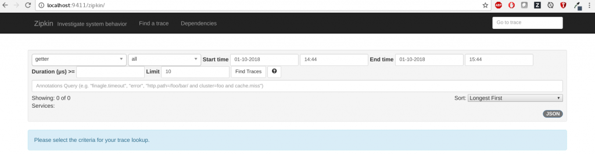

---

copyright:
  years: 2018
lastupdated: "2018-09-18"

---
{:new_window: target="_blank"}
{:shortdesc: .shortdesc}
{:screen: .screen}
{:codeblock: .codeblock}
{:pre: .pre}
{:tip: .tip}

# Configuration du traçage de bout en bout
{: #e2e-tracing}

Le tutoriel suivant se concentre sur Zipkin et l'utilisation du module [appmetrics-zipkin](https://github.com/RuntimeTools/appmetrics-zipkin) pour le traçage d'applications Node.js. Vous trouverez davantage d'informations sur Zipkin dans l'[annonce appmetrics-zipkin](https://developer.ibm.com/node/2017/10/26/add-zipkin-open-tracing-support-node-js-application-one-line-code/) d'origine. 

Dans la procédure suivante, deux petites applications (une à chaque extrémité) sont utilisées pour le traçage entre deux noeuds finaux via le module `appmetrics-zipkin`. Vous pouvez démarrer à partir de rien ou appliquer les principes décrits ici à vos applications Node.js existantes. 

## Etape 1. Installation et activation du module appmetrics-zipkin
{: #install-zipkin}

Au même emplacement que le fichier `package.json` de votre application Node.js, entrez la commande [npm](https://nodejs.org/) suivante pour ajouter le module `appmetrics-zipkin` à votre liste de dépendances :
```
npm install --save appmetrics-zipkin
```
{: codeblock}

Ajoutez la ligne suivante à votre code de serveur Node.js, **AVANT** toute autre instruction appmetrics `require` :
```js
var appzip = require('appmetrics-zipkin');
```
{: codeblock}

L'instruction suivante déclenche l'ajout du suivi à vos appels de méthode `HTTP` et `request`, ainsi que l'envoi des données au serveur Zipkin. Par défaut, le module recherche le serveur Zipkin sur `localhost` et sur le `port 9411`. Vous pouvez changer le nom d'hôte et le port en utilisant la syntaxe suivante : 
```js
var appzip = require('appmetrics-zipkin')({
 host: "my.host.here",
 port: 12345, // changeme
 serviceName:'my-service-name'
});
```
{: codeblock}

Envoyez une demande classique. Exemple :
```
http.request(options, callback).end();
```
{: codeblock} 

## Etape 2. Configuration d'un serveur Zipkin
{: #setup-zipkin-server}

Vous avez à présent besoin d'un espace où envoyer vos données, à savoir les traces, qui sont composées d'intervalles. Avant d'effectuer un déploiement sur un cloud, vous pouvez tester la configuration de traçage e2e en configurant un serveur Zipkin localement ou dans un conteneur. 

### Configuration de Zipkin en local

Zipkin est fourni dans un fichier `jar` unique pour vous permettre de le télécharger et de l'exécuter à l'aide des commandes suivantes sur le système sur lequel vous souhaitez que Zipkin soit disponible : 

1. Téléchargement de Zipkin :
  ```
  wget zipkin.jar 'https://search.maven.org/remote_content?g=io.zipkin.java&a=zipkin-server&v=1.31.3&c=exec'
  ```
  {: codeblock}

2. Démarrage de Zipkin :
  ```
  java -jar zipkin.jar
  ```
  {: codeblock}

  La commande `wget` télécharge le fichier Zipkin, et la commande `java -jar` démarre le serveur Zipkin. Vous pouvez également télécharger Zipkin depuis d'autres emplacements, mais il est important que vous utilisiez la version 1.x pour ce tutoriel, afin que le format de trace corresponde ce que le serveur Zipkin attend.

  Si la sortie de cette commande est trop prolixe, ou si vous souhaitez exécuter Zipkin en arrière-plan, vous pouvez ajouter `-q -O` pour la commande `wget` et `/dev/null 2>&1 &` pour Zipkin. A ce stade, vous téléchargez le fichier Zipkin `.jar` et exécutez la méthode principale pour démarrer le serveur Zipkin.

### Configuration de Zipkin dans un conteneur Docker

Vous avez la possibilité d'exécuter un serveur Zipkin dans un conteneur Docker via la commande suivante :
```
docker run -d -p 9411:9411 openzipkin/zipkin
```
{: codeblock}

Le module `openzipkin/zipkin` est téléchargé, installé et démarré sur le port `9411` à l'aide d'une simple commande.

### Accès à la console Zipkin
L'image suivante montre le serveur Zipkin s'exécutant sur `localhost`, sur le `port 9411`:



vous pouvez cliquer sur **Find traces** (rechercher les traces) et modifier les options de recherche pour afficher de manière sélective des traces spécifiques sur un certain laps de temps. Vous pouvez également filtrer pour afficher des traces impliquant des noms de service particuliers. Les noms de service sont spécifiez lorsque vous instrumentez votre code, et dans l'exemple de scénario nous utilisons “getter” et “pusher”.

## Etape 3. Test d'un exemple de scénario
{: #example-scenario}

Si vous suivez la [documentation du projet GitHub](https://github.com/ibm-developer/nodejs-zipkin-tracing), vous finissez avec l'exemple d'application suivant. Il s'agit d'un processus simple impliquant le traçage d'une demande et d'une réponse entre deux noeuds finaux. Les images suivantes montrent le serveur Zipkin avec affichage des données de trace collectées. L'élément clé à ne pas oublier est l'inclusion de `require('appmetrics-zipkin')`, et éventuellement le code de configuration du serveur Zipkin. Le scénario exemple ci-après montre comment rapidement ajouter une fonction de trace Zipkin à vos applications Node.js existantes. 

### Présentation des scénarios de traçage :
* Une application de **front end**, appelée pusher, invite l'utilisateur à indiquer la longueur d'une chaîne à créer et convertir en minuscules. Plus le nombre est élevé, plus grande sera la chaîne, et plus il faudra de temps pour gérer la demande. Disponible sur le `port 3000`.
* Une application de **back end**, appelée méthode d'accès get ou getter, gère la demande et est disponible sur le `port 3001`.
* Un **serveur Zipkin** s'exécute localement ou sur Kubernetes où vous voyez vos données de trace. 

### Application de front end (pusher)
Le service de pusher envoie la demande :


### Application de back end (getter)
L'application getter reçoit la demande, et écoute sur un port différent :


### Envoi d'une demande du pusher au getter
Envoi d'une demande du pusher au getter :


### Affichage des traces à l'aide de l'interface utilisateur Web Zipkin 
Les données de trace envoyées à Zipkin peuvent être consultées à l'aide de l'interface utilisateur Web Zipkin à l'adresse `localhost:9411`. Vous pouvez voir que le **getter** reçoit l'entrée utilisateur (souhaite envoyer un message de 500 caractères à la méthode d'accès get, via le service pusher) :


Les détails de la demande de l'utilisateur s'affichent. Notez le “500”, qui est un paramètre fourni pour la demande de l'utilisateur. Celui-ci souhaite générer une chaîne de 500 caractères. Vous pouvez voir exactement ce que l'utilisateur a demandé est le temps requis pour gérer cette demande. Le contenu de la demande, renvoyé depuis le serveur, n'est pas visible. 

Nous sommes concernés par les temps de réponse et les paramètres ; aussi souhaitons-nous pouvoir déterminer ce que les utilisateurs attendent lors qu'ils font l'expérience de temps de réponse lents :


### Identification de la demande lente
Voici ce à quoi ressemblerait une demande lente. L'utilisateur suivant demande à convertir 5 000 000 caractères de majuscules en minuscules (comme vous le faites). C'est une opération manifestement longue :


Cliquer sur l'intervalle génère la sortie suivante. Là encore, vous pouvez voir que la demande a consommé beaucoup plus de temps. Un scénario plus réaliste impliquerait éventuellement un nombre important de microservices Node.js recevant toutes sortes de demandes sur des noeuds finaux divers, le tout en continu. Disposer d'une vue de haut niveau de vos noeuds finaux vous permet de rapidement déterminer quels services répondent lentement, et ce que les utilisateurs demandent précisément :


Avec cet exemple, vous disposez à présent du scénario suivant :

* Le pusher envoie un message au getter (un intervalle).
* Le getter renvoie une réponse (un intervalle). 
* La trace complète, composée des deux intervalles, est visible sur le serveur Zipkin déployé en local. 

Lorsque vos applications gagnent en complexité et que vos services sont plus populaires, le besoin de mettre en place ce type de traçage devient évident. Mettre en place le traçage à un niveau élevé fournit des valeurs aux développeurs, si bien que les problèmes peuvent être identifiés et triés rapidement et efficacement. De nombreuses solutions de rechange existent, mais notre approche consiste à rendre le process aussi simple que possible, et à agir de façon totalement ouverte.

Le tutoriel sur les déploiements sans Kubernetes s'achève ici. Consultez la section suivante si vous souhaitez poursuivre avec le traçage d'applications Node.js s'exécutant sur Kubernetes.

## Etapes suivantes
{: #next-steps}

* Apprenez à générer des applications Node.js natives cloud avec l'aide du projet communautaire [CloudNativeJS](https://www.cloudnativejs.io/), qui fournit des actifs et des outils pour vous permettre de les déployer dans des clouds basés Docker et Kubernetes.

* Si vous êtes prêt à ajouter le traçage à vos applications Node.js s'exécutant sur Kubernetes, consultez [tracing Node.js applications that use Kubernetes](https://developer.ibm.com/node/tutorial-end-end-tracing-node-js-applications/#appservice).

