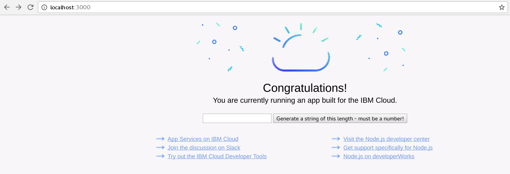

---

copyright:
  years: 2018, 2019
lastupdated: "2019-01-14"

---

{:new_window: target="_blank"}
{:shortdesc: .shortdesc}
{:screen: .screen}
{:codeblock: .codeblock}
{:pre: .pre}
{:tip: .tip}

# Impostazione della traccia end-to-end
{: #e2e-tracing}

La seguente esercitazione si concentra su Zipkin e sull'utilizzo del modulo [appmetrics-zipkin](https://github.com/RuntimeTools/appmetrics-zipkin) per la traccia delle applicazioni Node.js. Puoi imparare di più su Zipkin nell'[annuncio relativo a appmetrics-zipkin](https://developer.ibm.com/node/2017/10/26/add-zipkin-open-tracing-support-node-js-application-one-line-code/) originale. 

Nei seguenti passi, due piccole applicazioni (una front end e una back end) vengono utilizzate per la traccia tra due endpoint utilizzando il modulo `appmetrics-zipkin`. Puoi iniziare da zero oppure applicare i principi qui descritti alle tue applicazioni Node.js esistenti. 

## Passo 1. Installazione e abilitazione del modulo appmetrics-zipkin
{: #install-zipkin}

Nella stessa ubicazione del file `package.json` dell'applicazione Node.js, immetti il seguente comando [npm](https://nodejs.org/) per aggiungere il modulo `appmetrics-zipkin` nel tuo elenco dipendenze:
```
npm install --save appmetrics-zipkin
```
{: codeblock}

Aggiungi la seguente riga al tuo codice server Node.js, **PRIMA** di qualsiasi altra istruzione `require` appmetrics.
```js
var appzip = require('appmetrics-zipkin');
```
{: codeblock}

la seguente istruzione determina l'aggiunta della traccia alle tue chiamate del metodo `HTTP` e `request` e l'invio dei dati al server Zipkin. Per impostazione predefinita, il modulo cerca il server Zipkin su `localhost` e sulla porta `9411`. Puoi modificare il nome host e la porta utilizzando la seguente sintassi:
```js
var appzip = require('appmetrics-zipkin')({
 host: "my.host.here",
 port: 12345, // changeme
 serviceName:'my-service-name'
});
```
{: codeblock}

Invia una richiesta come faresti normalmente. Ad esempio:
```
http.request(options, callback).end();
```
{: codeblock} 

## Passo 2. Configurazione di un server Zipkin
{: #setup-zipkin-server}

Ora ti serve un'ubicazione a cui inviare i tuoi dati, specificamente le tracce, che sono costituite da estensioni. Prima che tu esegua la distribuzione a qualsiasi cloud, puoi testare la configurazione della traccia e2e configurando un server Zipkin localmente oppure in un contenitore. 

### Configurazione di Zipkin localmente
{: #local-setup-zipkin}

Zipkin viene fornito in un singolo file `jar` per consentirti di scaricarlo ed eseguirlo utilizzando i seguenti comandi sul sistema dove desideri che Zipkin sia disponibile:

1. Download di Zipkin:
  ```
  wget zipkin.jar 'https://search.maven.org/remote_content?g=io.zipkin.java&a=zipkin-server&v=1.31.3&c=exec'
  ```
  {: codeblock}

2. Avvio di Zipkin:
  ```
  java -jar zipkin.jar
  ```
  {: codeblock}

  Il comando `wget` scarica il file Zipkin e il comando `java -jar` avvia il server Zipkin. Puoi scaricare Zipkin anche da altre ubicazioni ma è importante che utilizzi la versione 1.x per questa esercitazione in modo che il formato della traccia corrisponda a quello che il server Zipkin si aspetta.

  Se l'output da questo comando è troppo dettagliato o desideri eseguire Zipkin in background, puoi aggiungere `-q -O` per il comando `wget` e `/dev/null 2>&1 &` per Zipkin. A questo punto, stai scaricando il file Zipkin `.jar ` e stai eseguendo il metodo principale per avviare il server Zipkin.

### Configurazione di Zipkin in un contenitore Docker
{: #setup-docker-zipkin}

Puoi, facoltativamente, eseguire un server Zipkin in un contenitore Docker eseguendo questo comando:
```
docker run -d -p 9411:9411 openzipkin/zipkin
```
{: codeblock}

Il modulo `openzipkin/zipkin` viene scaricato, installato e avviato sulla porta `9411` utilizzando un semplice comando.

### Accesso alla console Zipkin
{: #zipkin-console}

La seguente immagine mostra il server Zipkin in esecuzione su `localhost` sulla porta `9411`:


Puoi fare clic su **Find traces** e modificare le opzioni di ricerca per visualizzare in modo selettivo solo le tracce entro uno specifico periodo di tempo. Puoi anche applicare un filtro per visualizzare le tracce che coinvolgono degli specifici nomi del servizio. I nomi del servizio vengono specificati quando strumenti il tuo codice e, nello scenario di esempio, utilizziamo “getter” e “pusher”.

## Passo 3. Esecuzione del test di uno scenario di esempio
{: #example-scenario-tracing}

Se segui la [documentazione del progetto GitHub](https://github.com/ibm-developer/nodejs-zipkin-tracing),ti ritrovi con la seguente applicazione di esempio. È un semplice processo che implica la traccia di una richiesta e di una risposta tra due endpoint. Le seguenti immagini mostrano il server Zipkin con visualizzati i dati di traccia raccolti. Il punto chiave da ricordare è l'inclusione di `require('appmetrics-zipkin')` e, facoltativamente, il codice di configurazione del server Zipkin. Il seguente scenario di esempio mostra come puoi aggiungere rapidamente la traccia Zipkin nelle tue applicazioni Node.js esistenti.

### Panoramica dello scenario di traccia
{: #tracing-scenario}

* Un **front end**, che è noto come pusher, richiede all'utente la lunghezza di una stringa da creare e convertire in minuscole. Maggiore è il numero e più grande è la stringa, nonché più lungo il tempo che occorre per gestire la richiesta. Disponibile sulla porta `3000`.
* Un **back end**, noto come getter, gestisce la richiesta ed è disponibile sulla porta `3001`.
* Un **server Zipkin** viene eseguito in locale oppure su Kubernetes dove vedi i tuoi dati di traccia.

### Applicazione front-end (pusher)
{: #tracing-pusher}

Il servizio dell'applicazione front-end (pusher) invia la richiesta (il nostro semplice front end):


### Applicazione back-end (getter)
{: #tracing-getter}

L'applicazione back-end (getter) riceve la richiesta, che è in ascolto su una porta differente:


### Invio di una richiesta dal pusher al getter
{: #tracing-request}

Invia una richiesta dal pusher al getter:


### Visualizzazione delle tracce con l'IU web Zipkin
{: #tracing-viewing}

I dati di traccia inviati a Zipkin possono essere visualizzati con l'IU web Zipkin su `localhost:9411`. Puoi vedere che il **getter** riceve l'input utente (l'utente vuole inviare un messaggio lungo 500 caratteri al getter utilizzando il servizio pusher):


Vengono visualizzati i dettagli della richiesta dell'utente. Nota il valore “500”, che è il parametro fornito per la richiesta dell'utente. Quest'ultimo voleva generare una stringa di 500 caratteri. Puoi vedere esattamente cosa aveva richiesto l'utente e quanto tempo ci è voluto per gestire questa richiesta. Il contenuto della richiesta (payload) restituito dal server non è visibile. 

Prestiamo attenzione ai tempi di risposta e ai parametri in modo da poter determinare cosa stanno richiedendo gli utenti quando riscontrano dei tempi di risposta lenti: 

### Identificazione della richiesta lenta
{: #tracing-slowreq}

Ecco come si presenta una richiesta lenta. Il seguente utente sta richiedendo di convertire 5.000.000 di caratteri da maiuscole a minuscole (come fai tu). È qualcosa che ovviamente richiede più tempo:


Facendo clic su questa estensione, si produce il seguente output. Di nuovo, puoi vedere la richiesta, costosa in termini di tempo, che ha consumato molto più tempo. Uno scenario più realistico coinvolgerebbe potenzialmente molti microservizi Node.js che ricevono tutti i tipi di richieste a diversi endpoint continuamente. Disponendo di una vista di alto livello dei tuoi endpoint, puoi determinare rapidamente quali servizi stanno rispondendo lentamente ed esattamente cosa stanno richiedendo gli utenti:


Con questo esempio, ora hai il seguente scenario:

* Il pusher invia un messaggio al getter (una estensione).
* Il getter restituisce una risposta (una estensione).
* La traccia completa, costituita dalle due estensioni, è visibile sul server Zipkin distribuito localmente.

Man mano che le tue applicazioni diventano più complesse, e i tuoi servizi diventano più diffusi, la necessità di disporre dell'implementazione di una traccia di questo tipo diventa ovvia. La traccia a un alto livello è utile per gli sviluppatori poiché consente di identificare e definire la priorità dei problemi in modo rapido ed efficace. Sono disponibili molte alternative ma il nostro approccio consiste nel rendere il processo quanto più semplice è possibile e di agire in modo del tutto trasparente.

L'esercitazione termina qui per le distribuzioni senza Kubernetes. Consulta la sezione successiva se vuoi continuare a ottenere informazioni sulla traccia delle applicazioni Node.js che vengono eseguite su Kubernetes.

## Passi successivi
{: #next-steps-tracing}

* Impara a creare applicazioni Node.js native cloud con l'ausilio del progetto della community [CloudNativeJS](https://www.cloudnativejs.io/) che fornisce risorse e strumenti che ti aiutano a distribuirle a cloud basati su Docker e Kubernetes.

* Se sei pronto ad aggiungere la traccia alle tue applicazioni Node.js che vengono eseguite su Kubernetes, consulta il documento relativo alla [traccia delle applicazioni Node.js che utilizzano Kubernetes](https://developer.ibm.com/node/tutorial-end-end-tracing-node-js-applications/#appservice).

