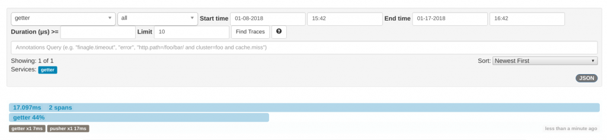
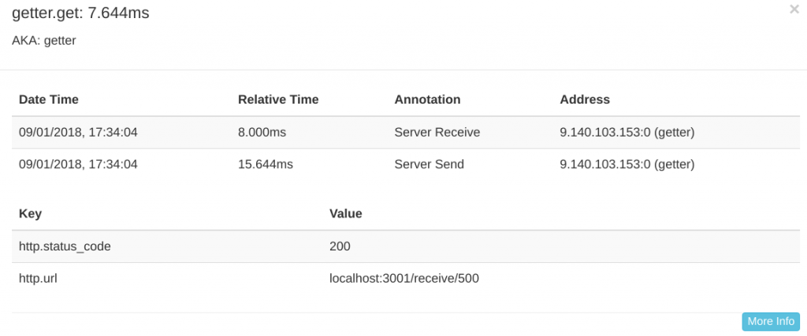

---

copyright:
  years: 2018
lastupdated: "2018-09-18"

---
{:new_window: target="_blank"}
{:shortdesc: .shortdesc}
{:screen: .screen}
{:codeblock: .codeblock}
{:pre: .pre}
{:tip: .tip}

# エンドツーエンド・トレースのセットアップ
{: #e2e-tracing}

以下のチュートリアルでは、Zipkin についてと、Node.js アプリケーションのトレースのための [appmetrics-zipkin](https://github.com/RuntimeTools/appmetrics-zipkin) モジュールの使用について重点的に説明します。 Zipkin について詳しくは、元の [appmetrics-zipkin 発表](https://developer.ibm.com/node/2017/10/26/add-zipkin-open-tracing-support-node-js-application-one-line-code/)を参照してください。 

以下のステップでは、2 つの小さなアプリケーション (1 つはフロントエンド、もう 1 つはバックエンド) を使用して、2 つのエンドポイント間で `appmetrics-zipkin` モジュールを使用したトレースが行われます。 最初から開始することも、既存の Node.js アプリケーションにここで説明する原則を適用することもできます。 

## ステップ 1. appmetrics-zipkin モジュールのインストールと有効化
{: #install-zipkin}

Node.js アプリケーションの `package.json` ファイルと同じ場所で、以下の [npm](https://nodejs.org/) コマンドを入力して `appmetrics-zipkin` モジュールを依存関係リストに追加します。
```
npm install --save appmetrics-zipkin
```
{: codeblock}

Node.js サーバー・コードに次の行を追加します。他の appmetrics `require` ステートメントの**前**に追加してください。
```js
var appzip = require('appmetrics-zipkin');
```
{: codeblock}

このステートメントにより、`HTTP` および `request` メソッド呼び出しにトレースが追加され、Zipkin サーバーにデータが送信されるようになります。 デフォルトでは、このモジュールは `localhost` およびポート `9411` で Zipkin サーバーを探します。ホスト名とポートは以下の構文を使用して変更できます。
```js
var appzip = require('appmetrics-zipkin')({
 host: "my.host.here",
 port: 12345, // changeme
 serviceName:'my-service-name'
});
```
{: codeblock}

通常行うように要求を送信します。 例えば次のようにします。
```
http.request(options, callback).end();
```
{: codeblock} 

## ステップ 2. Zipkin サーバーのセットアップ
{: #setup-zipkin-server}

次に、データの送信先にする場所、具体的には、スパンから構成されるトレースが必要です。 クラウドにデプロイする前に、Zipkin サーバーをローカルにセットアップするか、コンテナー内でセットアップすることによって、e2e トレース構成をテストすることができます。 

### Zipkin のローカルでのセットアップ

Zipkin は、単一の `jar` ファイルで提供されるため、Zipkin を使用できるようにしたいシステムで以下のコマンドを使用することによって、ダウンロードおよび実行することができます。

1. Zipkin のダウンロード:
  ```
  wget zipkin.jar 'https://search.maven.org/remote_content?g=io.zipkin.java&a=zipkin-server&v=1.31.3&c=exec'
  ```
  {: codeblock}

2. Zipkin の開始:
  ```
  java -jar zipkin.jar
  ```
  {: codeblock}

  上記の `wget` コマンドは Zipkin ファイルをダウンロードし、`java -jar` コマンドは Zipkin サーバーを開始します。 Zipkin は他の場所からもダウンロードできますが、このチュートリアルでは、Zipkin サーバーが予期するものとトレース形式が一致するように、バージョン 1.x を使用することが重要です。

  このコマンドからの出力が冗長過ぎるか、または Zipkin をバックグラウンドで実行したい場合は、`wget` コマンドに`-q -O` を追加し、Zipkin に `/dev/null 2>&1 &` を追加できます。 この段階で、Zipkin `.jar` ファイルをダウンロードし、Zipkin サーバーを開始するための main メソッドを実行しています。

### Docker コンテナー内での Zipkin のセットアップ

オプションで、以下のコマンドを実行して、Docker コンテナー内で Zipkin サーバーを実行できます。
```
docker run -d -p 9411:9411 openzipkin/zipkin
```
{: codeblock}

1 つの単純なコマンドを使用することで、`openzipkin/zipkin` モジュールがダウンロードされ、インストールされ、ポート `9411` で開始されます。

### Zipkin コンソールへのアクセス
以下のイメージは、`localhost` のポート `9411` で実行されている Zipkin サーバーを示しています。


**「トレースの検索」**をクリックし、検索オプションを変更して、特定の期間内のトレースのみを選択的に表示することができます。 特定のサービス名に関係するトレースを表示するようにフィルタリングすることもできます。 サービス名はコードの装備時に指定され、シナリオ例では「getter」および「pusher」が使用されています。

## ステップ 3. シナリオ例のテスト
{: #example-scenario}

[GitHub プロジェクトの資料](https://github.com/ibm-developer/nodejs-zipkin-tracing)に従うと、最後に以下のサンプル・アプリケーションが得られます。 これは 2 つのエンドポイント間の要求と応答のトレースが関係する単純なプロセスです。 以下のイメージは、Zipkin サーバーと、収集されたトレース・データの表示を示しています。 覚えておくべき重要なポイントは、`require ('appmetrics-zipkin')`、およびオプションで Zipkin サーバー構成コードを含めることです。 以下のシナリオ例は、Zipkin トレースを既存の Node.js アプリケーションに迅速に追加する方法を示しています。

### トレース・シナリオの概要:
* **フロントエンド** (pusher と呼ばれます) は、作成して小文字に変換するストリングの長さを指定するようユーザーに求めるプロンプトを出します。 この数値が大きいほど、ストリングが長くなり、要求の処理にかかる時間も長くなります。 ポート `3000` で使用可能です。
* **バックエンド** (getter と呼ばれます) は、要求を処理し、ポート `3001` で使用可能です。
* **Zipkin サーバー** は、ローカルに実行されるか、Kubernetes で実行され、そこでトレース・データを表示することになります。

### フロントエンド・アプリ (pusher)
フロントエンド・アプリ (pusher) サービスは要求を送信します (この例ではごく単純なフロントエンドです):


### バックエンド・アプリ (getter)
別のポートで listen しているバックエンド・アプリ (getter) が要求を受け取ります。


### pusher から getter への要求の送信
pusher から getter へ要求を送信します。


### Zipkin Web UI でのトレースの表示
Zipkin に送信されたトレース・データは `localhost:9411` で Zipkin Web UI を使用して表示できます。 **getter** がユーザー入力を受け取るのを表示内容から確認できます (ユーザーは pusher サービスを使用して長さ 500 文字のメッセージを getter に送信しようとしています):


ユーザー要求の詳細が表示されます。 ユーザーの要求に対して指定されるパラメーターである「500」に注目してください。 ユーザーは長さ 500 文字のストリングの生成を要求しました。 ユーザーが要求した正確な内容と、この要求の処理にかかった時間が表示されます。 サーバーから返される、要求の内容 (ペイロード) は表示されません。 

懸念されるのは応答時間とパラメーターなので、応答時間が遅くなっているときにユーザーが何を要求しているのかを判別できます。


### 遅い要求の識別
以下に、遅い要求の例を示します。 このユーザーは、5,000,000 文字を大文字から小文字に変換するように要求しています。 これには長い時間がかかっています。


このスパンをクリックすると、以下の出力が表示されます。 再び、より多くの時間を消費した負荷のかかる要求を確認できます。 より現実的なシナリオでは、多数の Node.js マイクロサービスがさまざまなエンドポイントで継続的に各種の要求を受け取る可能性があります。 エンドポイントの概略を把握することによって、応答が遅いサービスを素早く判別したり、ユーザーが何を要求しているのかを正確に判別したりできます。


このシナリオ例では次のようになっています。

* pusher はメッセージを getter に送信します (1 つのスパン)。
* getter は応答を返送します (1 つのスパン)。
* これら 2 つのスパンで構成されるフル・トレースが、ローカルにデプロイされた Zipkin サーバーで表示されます。

アプリケーションがより複雑になり、サービスがより広く使用されるようになるにつれて、そのようなトレースを実施する必要性が高まってきます。 高水準のトレースは、開発者に価値を提供して、問題の識別と優先順位付けを迅速かつ効果的に行えるようにします。 多くの選択肢がありますが、ここで説明した方法はそれをできるだけ単純にし、完全にオープンです。

このチュートリアルは、Kubernetes のないデプロイメントの場合はここで終了です。 Kubernetes で実行される Node.js アプリのトレースに進みたい場合は、次のセクションを参照してください。

## 次のステップ
{: #next-steps}

* [CloudNativeJS](https://www.cloudnativejs.io/) コミュニティー・プロジェクトを利用して、クラウド・ネイティブ Node.js アプリケーションの作成方法を学習します (このコミュニティー・プロジェクトでは、それらを Docker および Kubernetes ベースのクラウドにデプロイするのを支援するためのアセットおよびツールが提供されています)。

* Kubernetes 上で実行される Node.js アプリケーションにトレースを追加する準備ができている場合、[Kubernetes を使用する Node.js アプリケーションのトレース](https://developer.ibm.com/node/tutorial-end-end-tracing-node-js-applications/#appservice)を参照してください。

