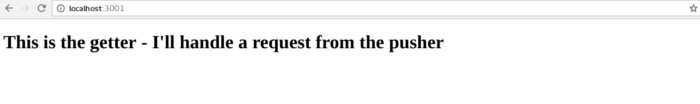

---

copyright:
  years: 2018, 2019
lastupdated: "2019-01-14"

---

{:new_window: target="_blank"}
{:shortdesc: .shortdesc}
{:screen: .screen}
{:codeblock: .codeblock}
{:pre: .pre}
{:tip: .tip}

# 엔드-투-엔드 추적 설정
{: #e2e-tracing}

다음 튜토리얼은 Node.js 애플리케이션 추적을 위한 Zipkin 및 [appmetrics-zipkin](https://github.com/RuntimeTools/appmetrics-zipkin) 모듈 사용에 초점이 맞춰져 있습니다. 원본 [appmetrics-zipkin 공지사항](https://developer.ibm.com/node/2017/10/26/add-zipkin-open-tracing-support-node-js-application-one-line-code/)에서 Zipkin에 대해 더 자세히 알아볼 수 있습니다. 

다음 단계에서는 두 개의 소형 애플리케이션(하나는 프론트 엔드, 다른 하나는 백엔드)이 `appmetrics-zipkin` 모듈을 사용하여 두 엔드포인트 간을 추적하는 데 사용됩니다. 사용자는 처음부터 시작하거나 여기에 설명된 원리를 기존 Node.js 애플리케이션에 적용할 수 있습니다. 

## 1단계. appmetrics-zipkin 모듈 설치 및 사용 설정
{: #install-zipkin}

Node.js 애플리케이션의 `package.json` 파일과 동일한 위치에서 다음 [npm](https://nodejs.org/) 명령을 입력하여 `appmetrics-zipkin` 모듈을 종속 항목 목록에 추가하십시오.
```
npm install --save appmetrics-zipkin
```
{: codeblock}

다음 행을 Node.js 서버 코드에 있는 모든 다른 appmetrics `require`문보다 **앞**에 추가하십시오.
```js
var appzip = require('appmetrics-zipkin');
```
{: codeblock}

다음 명령문은 `HTTP` 및 `request` 메소드 호출에 추적을 추가하며, Zipkin 서버에 데이터가 전송되도록 합니다. 기본적으로 모듈은 `localhost` 및 포트 `9411`에서 Zipkin 서버를 찾습니다. 다음 구문을 사용하여 호스트 이름 및 포트를 변경할 수 있습니다.
```js
var appzip = require('appmetrics-zipkin')({
 host: "my.host.here",
 port: 12345, // changeme
 serviceName:'my-service-name'
});
```
{: codeblock}

일반적인 경우와 동일하게 요청을 전송하십시오. 예를 들면 다음과 같습니다.
```
http.request(options, callback).end();
```
{: codeblock} 

## 2단계. Zipkin 서버 설정
{: #setup-zipkin-server}

이제는 기간으로 구성된 데이터(구체적으로는 추적)를 전송할 위치가 필요합니다. 클라우드에 배치하기 전에, 로컬 또는 컨테이너에 Zipkin 서버를 설정하여 엔드-투-엔드 추적 구성을 테스트할 수 있습니다. 

### 로컬에서의 Zipkin 설정
{: #local-setup-zipkin}

Zipkin은 하나의 `jar` 파일로 제공되므로, 사용자는 Zipkin을 사용할 수 있도록 할 시스템에서 다음 명령을 사용하여 이를 다운로드하고 실행할 수 있습니다.

1. Zipkin 다운로드:
  ```
  wget zipkin.jar 'https://search.maven.org/remote_content?g=io.zipkin.java&a=zipkin-server&v=1.31.3&c=exec'
  ```
  {: codeblock}

2. Zipkin 시작:
  ```
  java -jar zipkin.jar
  ```
  {: codeblock}

  `wget` 명령은 Zipkin 파일을 다운로드하며, `java -jar` 명령은 Zipkin 서버를 시작합니다. Zipkin을 다른 위치에서 다운로드할 수도 있지만, 추적 형식이 Zipkin 서버에서 예상하는 것과 일치하도록 하기 위해 이 튜토리얼에서는 버전 1.x를 사용하는 것이 중요합니다.

  이 명령의 출력이 너무 상세하거나 Zipkin을 백그라운드에서 실행하려는 경우에는 `wget` 명령에 `-q -O`를 추가하고 Zipkin에 대해 `/dev/null 2>&1 &`를 추가할 수 있습니다. 이 단계에서는 Zipkin `.jar` 파일을 다운로드하고 기본 메소드를 실행하여 Zipkin 서버를 시작합니다.

### Docker 컨테이너에서의 Zipkin 설정
{: #setup-docker-zipkin}

다음 명령을 실행하여 선택적으로 Zipkin 서버를 Docker 컨테이너에서 실행할 수 있습니다.
```
docker run -d -p 9411:9411 openzipkin/zipkin
```
{: codeblock}

하나의 간단한 명령을 사용하여, `openzipkin/zipkin` 모듈이 다운로드되어 설치된 후 포트 `9411`에서 시작됩니다.

### Zipkin 콘솔 액세스
{: #zipkin-console}

다음 그림은 `localhost` 및 포트 `9411`에서 실행되는 Zipkin 서버를 보여줍니다.


**추적 찾기**를 클릭하고 검색 옵션을 수정하여 선택적으로 특정 기간 내의 추적만 표시할 수 있습니다. 특정 서비스 이름을 포함하는 추적만 표시하도록 필터링할 수도 있습니다. 서비스 이름은 코드를 작성할 때 지정되며, 이 예에서는 "getter" 및 "pusher"를 사용합니다.

## 3단계. 시나리오 예 테스트
{: #example-scenario-tracing}

[GitHub 프로젝트 문서](https://github.com/ibm-developer/nodejs-zipkin-tracing)의 지시를 따르면 다음 샘플 애플리케이션이 작성됩니다. 이는 두 엔드포인트 간 요청 및 응답의 추적을 포함하는 간단한 프로세스입니다. 다음 이미지는 수집된 추적 데이터가 표시된 Zipkin 서버를 보여줍니다. 기억해야 하는 요점은 `require('appmetrics-zipkin')`이 포함되었다는 것이며, 선택적으로는 Zipkin 서버 구성 코드도 포함됩니다. 다음 시나리오 예는 얼마나 빨리 기존 Node.js 애플리케이션에 Zipkin 추적을 추가할 수 있는지 보여줍니다.

### 추적 시나리오 개요
{: #tracing-scenario}

* pusher라는 **프론트 엔드**는 사용자에게 작성하여 소문자로 변환할 문자열 길이를 입력하도록 프롬프트를 표시합니다. 숫자가 클수록 문자열이 커지며 요청을 처리하는 데 소요되는 시간이 늘어납니다. 포트 `3000`에서 사용 가능합니다.
* getter라는 **백엔드**는 요청을 처리하며 포트 `3001`에서 사용 가능합니다.
* **Zipkin 서버**는 추적 데이터가 표시되는 로컬 시스템 또는 Kubernetes에서 실행됩니다.

### 프론트 엔드 앱(pusher)
{: #tracing-pusher}

프론트 엔드 앱(pusher) 서비스는 요청을 전송합니다(단순 프론트 엔드).


### 백엔드(getter)
{: #tracing-getter}

백엔드 앱(getter)은 다른 포트를 청취하며 요청을 수신합니다.


### pusher에서 getter로 요청 전송
{: #tracing-request}

pusher에서 getter로 요청을 전송합니다.


### Zipkin 웹 UI를 사용하여 추적 보기
{: #tracing-viewing}

Zipkin에 전송된 추적 데이터는 Zipkin 웹 UI(`localhost:9411`)를 사용하여 볼 수 있습니다. 사용자는 **getter**가 사용자 입력을 수신하는 것을 볼 수 있습니다(사용자는 pusher 서비스를 사용하여 500자 길이의 메시지를 getter에 전송하려 함).


사용자 요청 세부사항이 표시됩니다. 사용자의 요청에 대해 제공된 매개변수인 "500"을 볼 수 있습니다. 사용자는 500자 길이의 문자열을 생성하려 합니다. 여기서는 사용자가 정확히 무엇을 요청했는지, 그리고 이 요청을 처리하는 데 어느 정도의 시간이 소요되는지 볼 수 있습니다. 서버에서 리턴된 요청의 컨텐츠(페이로드)는 표시되지 않습니다. 

여기서는 느린 응답 시간이 발생하는 상황에서 사용자가 무엇을 요청했는지 판별할 수 있도록 응답 시간과 매개변수를 알아볼 것입니다.


### 느린 요청 식별
{: #tracing-slowreq}

느린 요청은 다음과 같습니다. 다음 사용자는 5,000,000자를 대문자에서 소문자로 변환하려 요청합니다. 이 요청은 분명히 처리하는 데 오랜 시간이 소요됩니다.


이 기간을 클릭하면 다음 출력이 생성됩니다. 많은 시간이 소요되는 요청을 다시 한 번 볼 수 있습니다. 더 현실적인 시나리오에서는 다양한 엔드포인트에서 지속적으로 매우 다양한 요청을 수신하는 여러 Node.js 마이크로서비스가 포함될 것입니다. 엔드포인트에 대한 상위 레벨 보기를 확보하면 어느 서비스가 느리게 응답하고 있는지, 그리고 사용자가 정확히 무엇을 요청하고 있는지 빠르게 판별할 수 있습니다.


이 예를 통해 다음과 같은 시나리오를 도출할 수 있습니다.

* pusher가 메시지를 getter에 전송합니다(1회 기간).
* getter가 응답을 전송합니다(1회 기간).
* 2회 기간으로 구성된 전체 추적을 로컬에 배치된 Zipkin 서버에서 볼 수 있습니다.

애플리케이션이 더 복잡해지고 서비스 사용 횟수가 늘어나면 이러한 추적을 설정해야 하는 필요성이 확실해집니다. 상위 레벨에서의 추적은 문제점을 식별한 후 빠르고 효과적으로 수정할 수 있게 해 주므로 개발자에게 매우 유용합니다. 사용할 수 있는 대안에는 여러가지가 있지만, 이 접근법의 목표는 작업을 가능한 한 간단하게 하고, 모든 작업을 공개적으로 수행하는 것입니다.

Kubernetes를 사용하지 않은 배치에 대한 튜토리얼은 여기서 끝납니다. Kubernetes에서 실행되는 Node.js 앱을 추적하는 방법을 알아보려면 다음 절을 참조하십시오.

## 다음 단계
{: #next-steps-tracing}

* 클라우드 네이티브 Node.js 애플리케이션을 Docker 및 Kubernetes 기반 클라우드에 배치하는 데 도움을 주는 자산 및 도구를 제공하는 [CloudNativeJS](https://www.cloudnativejs.io/) 커뮤니티 프로젝트의 도움을 받아, 클라우드 네이티브 Node.js 애플리케이션을 빌드하는 방법을 알아보십시오.

* Kubernetes에서 실행되는 Node.js 애플리케이션에 추적을 추가할 준비가 된 경우에는 [Kubernetes를 사용하는 Node.js 애플리케이션 추적](https://developer.ibm.com/node/tutorial-end-end-tracing-node-js-applications/#appservice)을 참조하십시오.

