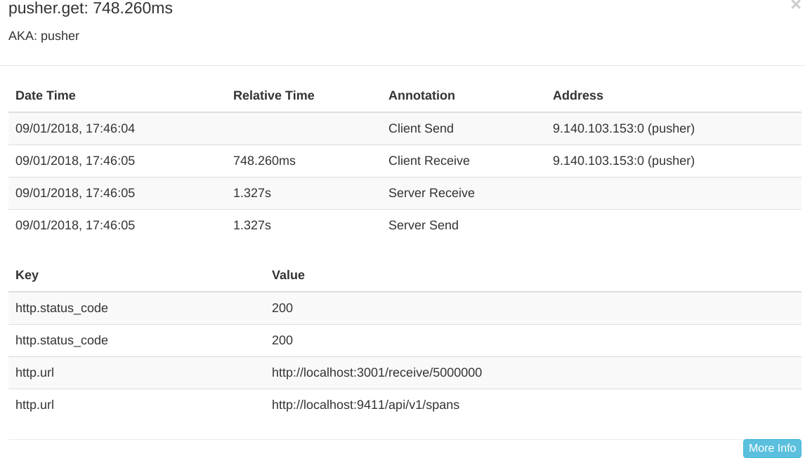

---

copyright:
  years: 2018, 2019
lastupdated: "2019-06-05"

keywords: nodejs tracing, debug nodejs apps, troubleshooting nodejs, appmetrics-zipkin node, zipkin docker nodejs, nodejs slow, nodejs tracing

subcollection: nodejs

---

{:new_window: target="_blank"}
{:shortdesc: .shortdesc}
{:screen: .screen}
{:codeblock: .codeblock}
{:pre: .pre}
{:tip: .tip}

# Configurando o rastreio de ponta a ponta
{: #e2e-tracing}

O tutorial a seguir tem como foco o Zipkin e o uso do módulo [appmetrics-zipkin](https://github.com/CloudNativeJS/appmetrics-zipkin){: new_window} para rastrear aplicativos Node.js. É possível aprender mais sobre o Zipkin no [Comunicado sobre o appmetrics-zipkin](https://developer.ibm.com/node/2017/10/26/add-zipkin-open-tracing-support-node-js-application-one-line-code/){: new_window} original. 

Nas etapas a seguir, dois pequenos aplicativos (um de front-end, um de backend) são usados para rastrear entre dois terminais usando o módulo `appmetrics-zipkin`. É possível iniciar do zero ou aplicar os princípios descritos aqui a seus aplicativos Node.js existentes. 

## Etapa 1. Instalando e ativando o módulo appmetrics-zipkin
{: #install-zipkin}

No mesmo local que o arquivo `package.json` do aplicativo Node.js, insira o comando [npm](https://nodejs.org/en/){: new_window} a seguir para incluir o módulo `appmetrics-zipkin` em sua lista de dependências:
```
npm install -- save appmetrics-zipkin
```
{: codeblock}

Inclua a linha a seguir em seu código do servidor Node.js **ANTES** de quaisquer outras instruções `require` do appmetrics:
```js
var appzip = require ('appmetrics-zipkin');
```
{: codeblock}

A instrução a seguir faz com que o rastreio seja incluído nas chamadas de método `HTTP` e `request` e os dados sejam enviados para o servidor Zipkin. Por padrão, o módulo procura o servidor Zipkin em `localhost` e a porta `9411`. É possível mudar o nome do host e a porta usando a sintaxe a seguir:
```js
var appzip = require('appmetrics-zipkin')({
 host: "my.host.here",
 port: 12345, // changeme
 serviceName:'my-service-name'
});
```
{: codeblock}

Envie uma solicitação como você normalmente faria. Por exemplo:
```
http.request (options, callback) .end ();
```
{: codeblock} 

## Etapa 2. Configurando um servidor Zipkin
{: #setup-zipkin-server}

Agora você precisa de um local para enviar seus dados, especificamente os rastreios, que são feitos de períodos. Antes de implementar em qualquer nuvem, é possível testar a configuração de rastreio e2e, configurando um servidor Zipkin localmente ou em um contêiner. 

### Configurando o Zipkin localmente
{: #local-setup-zipkin}

O Zipkin é fornecido em um único arquivo `jar` para que você possa fazer seu download e executá-lo usando os comandos a seguir no sistema no qual deseja que o Zipkin esteja disponível:

1. Fazendo download do Zipkin:
  ```
  wget zipkin.jar 'https://search.maven.org/remote_content?g=io.zipkin.java&a=zipkin-server&v=1.31.3&c=exec'
  ```
  {: codeblock}

2. Iniciando o Zipkin:
  ```
  java -jar zipkin.jar
  ```
  {: codeblock}

  O comando `wget` faz download do arquivo Zipkin e o comando `java -jar` inicia o servidor Zipkin. Também é possível fazer download do Zipkin de outros locais, mas é importante usar a versão 1.x para este tutorial para que o formato de rastreio corresponda ao que o servidor Zipkin está esperando.

  Se a saída desse comando for muito detalhada ou você quiser executar o Zipkin no segundo plano, será possível incluir `-q -O` para o comando `wget` e `/dev/null 2>&1 &` para o Zipkin. Nesse estágio, você está fazendo download do arquivo `.jar` do Zipkin e executando o método main para iniciar o servidor Zipkin.

### Configurando o Zipkin em um contêiner do Docker
{: #setup-docker-zipkin}

Opcionalmente, é possível executar um servidor Zipkin em um contêiner do Docker executando o comando a seguir:
```
docker run -d -p 9411:9411 openzipkin/zipkin
```
{: codeblock}

O módulo `openzipkin/zipkin` é transferido por download, instalado e iniciado na porta `9411` usando um simples comando.

### Acessando o console do Zipkin
{: #zipkin-console}

A imagem a seguir mostra o servidor Zipkin que é executado em `localhost` na porta `9411`:


É possível clicar em **Localizar rastreios** e modificar as opções de procura para mostrar seletivamente apenas os rastreios dentro de um determinado período. Também é possível filtrar para mostrar rastreios que envolvem nomes de serviço específicos. Os nomes de serviço são especificados quando você instrumenta seu código e, no cenário de exemplo, usamos "getter" e "pusher".

## Etapa 3. Testando um Cenário de Exemplo
{: #node-example-tracing}

Se você seguir a [documentação do projeto GitHub](https://github.com/ibm-developer/nodejs-zipkin-tracing){: new_window}, ficará com o aplicativo de amostra a seguir. É um processo simples que envolve rastrear uma solicitação e uma resposta entre dois terminais. As imagens a seguir mostram o servidor Zipkin com dados de rastreio coletados na exibição. O ponto chave a ser lembrado é a inclusão de `require('appmetrics-zipkin')` e, opcionalmente, o código de configuração do servidor Zipkin. O cenário de exemplo a seguir mostra como é possível incluir rapidamente o rastreio do Zipkin nos aplicativos Node.js existentes.

### Visão geral do cenário de rastreio
{: #tracing-scenario}

* Um **front-end**, conhecido como o pusher, solicita ao usuário o comprimento de uma sequência a ser criada e convertida em minúsculas. Quanto maior o número, maior a sequência e mais tempo ela levará para manipular a solicitação. Disponível na porta `3000`.
* Um **back-end**, conhecido como o getter, manipula a solicitação e está disponível na porta `3001`.
* Um **servidor Zipkin** é executado localmente ou no Kubernetes no qual você vê seus dados de rastreio.

### App front-end (pusher)
{: #tracing-pusher}

O serviço de app de front-end (pusher) envia a solicitação (nosso front-end simples):


### Aplicativo de backend (getter)
{: #tracing-getter}

O app de backend (getter) recebe a solicitação, que está atendendo em uma porta diferente:


### Enviando uma solicitação do pusher para o getter
{: #tracing-request}

Envie uma solicitação do pusher para o getter:


### Visualizando rastreios com a UI da web do Zipkin
{: #tracing-viewing}

Os dados de rastreio enviados para o Zipkin podem ser visualizados com a IU da web do Zipkin em `localhost:9411`. É possível ver que o **getter** recebe entrada do usuário (o usuário deseja enviar uma mensagem longa de 500 caracteres para o getter, usando o serviço pusher): 

Os detalhes da solicitação do usuário são mostrados. Observe o "500" que é o parâmetro fornecido para a solicitação do usuário. Eles queriam gerar uma sequência de 500 caracteres. É possível ver exatamente o que o usuário solicitou e quanto tempo levou para manipular essa solicitação. O conteúdo da solicitação (carga útil), retornado do servidor, não é visível. 

Estamos preocupados com os tempos de resposta e os parâmetros para que possamos determinar o que os usuários estão solicitando quando estão tendo tempos de resposta lentos:


### Identificando a solicitação lenta
{: #tracing-slowreq}

Aqui está como seria uma solicitação lenta. O usuário a seguir está solicitando a conversão de 5.000.000 de caracteres maiúsculos em minúsculos (do jeito que você faz). É algo que obviamente leva mais tempo:


Clicar nesse período leva à saída a seguir. Novamente, é possível ver a solicitação cara que consumiu muito mais tempo. Um cenário mais realista possivelmente envolveria muitos microsserviços do Node.js recebendo todas as maneiras de solicitações em vários terminais continuamente. Ao
ter uma visualização de alto nível de seus terminais, é possível determinar rapidamente quais serviços estão respondendo lentamente e exatamente o que os usuários estão solicitando:


Com esse exemplo, agora você tem o seguinte cenário:

* O pusher envia uma mensagem para o getter (um período).
* O getter retorna uma resposta (um período).
* O rastreio completo, que consiste em dois períodos, é visível no servidor Zipkin implementado localmente.

À medida que seus aplicativos se tornam mais complexos e seus serviços se tornam mais populares, a necessidade de ter esse tipo de rastreio em vigor torna-se óbvia. O rastreio em um alto nível fornece valor aos desenvolvedores para que os problemas possam ser identificados e classificados rápida e efetivamente. Há muitas alternativas disponíveis, mas nossa abordagem é torná-la o mais simples possível e agir inteiramente na abertura.

O tutorial acaba aqui para implementações sem o Kubernetes. Verifique a próxima seção se quiser prosseguir com o rastreio de apps Node.js executados no Kubernetes.

## Próximas etapas
{: #next-steps-tracing}

* Aprenda a construir aplicativos Node.js do Cloud Native com a ajuda do projeto da comunidade [CloudNativeJS](https://www.cloudnativejs.io/){: new_window}, que fornece ativos e ferramentas para ajudar você a implementá-los nas nuvens baseadas no Docker e no Kubernetes.

* Se você estiver pronto para incluir o rastreio em seus aplicativos Node.js que são executados no Kubernetes, consulte [Rastreando aplicativos Node.js que usam o Kubernetes](https://developer.ibm.com/node/tutorial-end-end-tracing-node-js-applications/#appservice){: new_window}.

