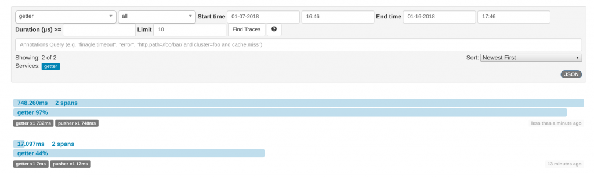

---

copyright:
  years: 2018
lastupdated: "2018-09-18"

---
{:new_window: target="_blank"}
{:shortdesc: .shortdesc}
{:screen: .screen}
{:codeblock: .codeblock}
{:pre: .pre}
{:tip: .tip}

# 設定完整追蹤
{: #e2e-tracing}

下列指導教學主要討論 Zipkin，以及使用 [appmetrics-zipkin](https://github.com/RuntimeTools/appmetrics-zipkin) 模組來追蹤 Node.js 應用程式。您可以在原始 [appmetrics-zipkin 公告](https://developer.ibm.com/node/2017/10/26/add-zipkin-open-tracing-support-node-js-application-one-line-code/)中進一步瞭解 Zipkin。 

在下列步驟中，使用兩個小型應用程式（一個前端，一個後端）在兩個端點之間使用 `appmetrics-zipkin` 模組進行追蹤。您可以從頭開始，或是將這裡說明的原則套用至現有的 Node.js 應用程式。 

## 步驟 1. 安裝並啟用 appmetrics-zipkin 模組
{: #install-zipkin}

在與 Node.js 應用程式 `package.json` 檔案的相同位置中，輸入下列 [npm](https://nodejs.org/) 指令，將 `appmetrics-zipkin` 模組新增至相依關係清單：
```
npm install --save appmetrics-zipkin
```
{: codeblock}

將下列這一行新增至 Node.js 伺服器程式碼的任何其他 appmetrics `require` 陳述式**前面**：
```js
var appzip = require('appmetrics-zipkin');
```
{: codeblock}

下列陳述式會將追蹤新增至 `HTTP` 及 `request` 方法呼叫，以及要傳送至 Zipkin 伺服器的資料。依預設，模組會在 `localhost` 及`埠 9411` 尋找 Zipkin 伺服器。您可以使用下列語法來變更主機名稱及埠：
```js
var appzip = require('appmetrics-zipkin')({
 host: "my.host.here",
 port: 12345, // changeme
 serviceName:'my-service-name'
});
```
{: codeblock}

請像平常一樣傳送要求。例如：
```
http.request(options, callback).end();
```
{: codeblock} 

## 步驟 2. 設定 Zipkin 伺服器
{: #setup-zipkin-server}

您現在需要一個將資料傳送至其中的位置，特別是由跨距組成的追蹤。在部署至任何雲端之前，您可以藉由在本端或在容器中設定 Zipkin 伺服器，來測試 e2e 追蹤配置。 

### 在本端設定 Zipkin

Zipkin 是以單一 `jar` 檔案提供，因此，您可以在想要 Zipkin 可供使用的系統上，使用下列指令下載並執行：

1. 下載 Zipkin：
  ```
  wget zipkin.jar 'https://search.maven.org/remote_content?g=io.zipkin.java&a=zipkin-server&v=1.31.3&c=exec'
  ```
  {: codeblock}

2. 啟動 Zipkin：
  ```
  java -jar zipkin.jar
  ```
  {: codeblock}

  `wget` 指令會下載 Zipkin 檔案，而 `java -jar` 指令會啟動 Zipkin 伺服器。您也可以從其他位置下載 Zipkin，但請務必使用 1.x 版的指導教學，追蹤格式才會符合 Zipkin 伺服器的預期。

  如果此指令的輸出太過冗長，或您要在背景中執行 Zipkin，則可以針對 `wget` 指令新增 `-q -O`，針對 Zipkin 新增 `/dev/null 2>&1 &`。在此階段中，您將下載 Zipkin `.jar` 檔案，並執行 main 方法來啟動 Zipkin 伺服器。

### 在 Docker 容器中設定 Zipkin

您可以執行下列指令，選擇性地在 Docker 容器中執行 Zipkin 伺服器：
```
docker run -d -p 9411:9411 openzipkin/zipkin
```
{: codeblock}

即會使用一個簡單指令，在埠 `9411` 下載、安裝及啟動 `openzipkin/zipkin` 模組。

### 存取 Zipkin 主控台
下圖顯示在 `localhost` 的`埠 9411` 執行的 Zipkin 伺服器：


您可以按一下**尋找追蹤**，並修改搜尋選項，來選擇性只顯示特定時段內的追蹤。您也可以過濾以顯示涉及特定服務名稱的追蹤。服務名稱是在您檢測程式碼時指定的，而在此範例情境中，我們使用 "getter" 及 "pusher"。

## 步驟 3. 測試範例情境
{: #example-scenario}

如果您遵循 [GitHub 專案的文件](https://github.com/ibm-developer/nodejs-zipkin-tracing)，則最後會有下列範例應用程式。這是一項簡單的處理程序，包括追蹤兩個端點之間的要求及回應。下圖顯示已顯示所收集追蹤資料的 Zipkin 伺服器。要記住的重點是包含 `require('appmetrics-zipkin')` 以及選用的 Zipkin 伺服器配置程式碼。下列範例情境顯示如何將 Zipkin 追蹤快速新增至現有的 Node.js 應用程式。

### 追蹤情境概觀：
* **前端**（稱為 pusher）提示使用者建立字串的長度並轉換為小寫。數字越大，字串就越大，而且處理要求所花的時間就越長。可在`埠 3000` 上使用。
* **後端**（稱為 getter）處理要求，而且可在`埠 3001` 上使用。
* **Zipkin 伺服器**在本端或在您查看追蹤資料的 Kubernetes 上執行。

### 前端應用程式 (pusher)
前端應用程式 (pusher) 服務會傳送要求（我們的簡單前端）：


### 後端應用程式 (getter)
後端應用程式 (getter) 會接收在不同埠上接聽的要求：


### 將要求從 pusher 傳送至 getter
將要求從 pusher 傳送至 getter：


### 使用 Zipkin Web 使用者介面檢視追蹤
使用 Zipkin Web 使用者介面，可以在 `localhost:9411` 檢視傳送至 Zipkin 的追蹤資料。您可以看到 **getter** 接收使用者輸入（他們想要使用 pusher 服務，將長度為 500 個字元的訊息傳送至 getter）：


即會顯示使用者要求詳細資料。請注意 "500"，這是針對使用者要求所提供的參數。他們想要產生 500 個字元的字串。您可以確切看到使用者所要求的內容，以及處理此要求所花的時間。伺服器所傳回的要求內容（有效負載）則不可見。 

我們很關心回應時間及參數，以判定使用者在遇到慢速回應時間時所要求的內容：


### 識別慢速要求
以下是慢速要求的樣子。下列使用者要求將 5,000,000 個字元從大寫轉換為小寫（就像您做的一樣）。這顯然需要較長的時間：


按一下此跨距會導致下列輸出。同樣地，您可以看到耗用更多時間的高成本要求。更實際的情境可能涉及許多 Node.js 微服務，而這些 Node.js 微服務會持續接收各種端點的各種要求方式。藉由具有端點的高階視圖，您可以快速判斷哪些服務回應緩慢，以及使用者確切要求的內容：


在此範例中，您現在具有下列情境：

* pusher 將訊息傳送給 getter（一個跨距）。
* getter 傳回回應（一個跨距）。
* 在本端部署的 Zipkin 伺服器上，可以看到由兩個跨距組成的完整追蹤。

當您的應用程式變得越來越複雜且您的服務越來越受歡迎時，備妥這類追蹤的需求就更為明顯。高階追蹤可將值提供給開發人員，以快速且有效地識別並分類問題。有許多替代方案可用，但我們的方式是讓它盡可能簡單，並完全公開運作。

在這裡，本指導教學是在沒有 Kubernetes 的情況下完成作業。如果您想要繼續追蹤在 Kubernetes 上執行的 Node.js 應用程式，請參閱下一節。

## 後續步驟
{: #next-steps}

* 瞭解如何透過 [CloudNativeJS](https://www.cloudnativejs.io/) 社群專案的協助來建置雲端原生 Node.js 應用程式，而此社群專案提供資產及工具，協助您將它們部署至 Docker 及 Kubernetes 型雲端。

* 如果您已準備好將追蹤新增至在 Kubernetes 上執行的 Node.js 應用程式，請參閱[追蹤使用 Kubernetes 的 Node.js 應用程式](https://developer.ibm.com/node/tutorial-end-end-tracing-node-js-applications/#appservice)。

