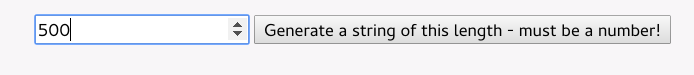

---

copyright:
  years: 2018
lastupdated: "2018-07-30"

---
{:new_window: target="_blank"}
{:shortdesc: .shortdesc}
{:screen: .screen}
{:codeblock: .codeblock}
{:pre: .pre}
{:tip: .tip}

# Setting up End-to-End tracing
{: #e2e-tracing}

The following tutorial focuses on Zipkin and the use of the [appmetrics-zipkin](https://github.com/RuntimeTools/appmetrics-zipkin) module for tracing Node.js applications. You can learn more about Zipkin in the original [appmetrics-zipkin announcement](https://developer.ibm.com/node/2017/10/26/add-zipkin-open-tracing-support-node-js-application-one-line-code/). 

In the following steps, two small applications (one front end, one back-end) are used to trace between two endpoints by using the `appmetrics-zipkin` module. You can start from scratch or apply the principles that are described here to your existing Node.js applications. 

## Step 1. Installing and enabling the appmetrics-zipkin module
{: #install-zipkin}

In the same location as your Node.js application’s `package.json` file, enter the following command to add the `appmetrics-zipkin` module into your dependency list:
```
npm install --save appmetrics-zipkin
```
{: codeblock}

Add the following line to your Node.js server code, **BEFORE** any other appmetrics `require` statements:
```
var appzip = require('appmetrics-zipkin');
```
{: codeblock}

This statement causes tracing to be added to your http and request method calls, and the data to be sent to the Zipkin server. By default, the module looks for the Zipkin server at `localhost` and `port 9411`, but you can change this as follows:
```
var appzip = require('appmetrics-zipkin')({
 host: "my.host.here",
 port: 12345, // changeme
 serviceName:'my-service-name'
});
```
{: codeblock}

Send a request as you normally would. For example:
```
http.request(options, callback).end();
```
{: codeblock} 

## Step 2. Setting up a local Zipkin server
{: #setup-zipkin-server}

Before deploying to any cloud, you can test the e2e tracing capabilities locally (deploying Zipkin in a container by using Kubernetes is documented later in this tutorial).

You now need a place to send your data to. Specifically, the traces, which are made up of spans. Fortunately, Zipkin is contained in a single `jar` file so you can download and run it using the following commands in a shell on the machine where you want Zipkin to be available:

Downloading Zipkin:
```
wget zipkin.jar 'https://search.maven.org/remote_content?g=io.zipkin.java&a=zipkin-server&v=1.31.3&c=exec'
```
{: codeblock}

Starting Zipkin:
```
java -jar zipkin.jar
```
{: codeblock}

The `wget` command downloads the Zipkin file we need, and the `java -jar` command runs the Zipkin server that it contains. You can download Zipkin from other locations too, but it’s important that you use version 1.x for this tutorial so the trace format matches what the Zipkin server is expecting.
If the output from this command is too verbose or you’d like to run Zipkin in the background, you can add `-q -O` for the `wget` command and `/dev/null 2>&1 &` for Zipkin. At this stage, you are simply downloading the Zipkin `.jar` file, and running the main method to start the Zipkin server.

The following image shows the Zipkin server running on `localhost` on `port 9411`:


You can click **Find traces** and modify the search options to selectively show only traces within a certain time period. You can also filter to show traces that involve specific service names. The service names are specified when you instrument your code, and in the example scenario we use “getter” and “pusher”.

## Step 3. Testing an example scenario
{: #example-scenario}

If you follow the [Github project’s documentation](https://github.com/ibm-developer/nodejs-zipkin-tracing), you end up with the following sample application. It’s a simple set-up that involves tracing a request and response between two endpoints. The following images show the Zipkin server with collected trace data on display. The key point to remember is the inclusion of `require('appmetrics-zipkin')`, and optionally the Zipkin server configuration code. The following example scenario shows how you can quickly add Zipkin tracing into your existing Node.js applications.

### Tracing scenario overview:
* A **front end**, known as the pusher, prompts the user for the length of a string to create and convert to lower case. The bigger the number, the bigger the string, and the longer it takes to handle the request. Available on `port 3000`.
* A **back-end**, known as the getter, handles the request and is available on `port 3001`.
* A **Zipkin server** running locally or on Kubernetes. (This is where you see your trace data.)

### Front end app (pusher)
The front end app (pusher) service sends the request (our simple front-end):


### Back-end app (getter)
The back-end app (getter) receives the request, which is listening on a different port:


### Sending a request from the pusher to the getter
This is how you can send a request from the pusher to the getter:


### Viewing traces with the Zipkin web UI
The trace data sent to Zipkin can be viewed with the Zipkin web UI at `localhost:9411`. You can see the **getter** receiving user input (they’re wanting to send a 500 character long message to the getter, by using the pusher service):


The user request details are shown. Notice the “500” which is the parameter that is provided for the user’s request. They wanted to generate a string of 500 characters. You can see exactly what the user requested and how long it took to handle this request. The contents of the request (payload), returned from the server, is not visible. 

We are concerned with response times, and the parameters so we can determine what users are requesting when they’re experiencing slow response times: 


### Identifying the slow request
Here’s what a slow request would look like. The following user is requesting to convert 5,000,000 characters from upper case to lower case (as you do). It’s something that obviously takes longer:


Clicking this span leads to the following output. Again, you can see the expensive request that consumed much more time. A more realistic scenario would involve potentially many Node.js microservices receiving all manner of requests at various endpoints continuously. By having a high-level view of your endpoints, you can quickly determine which services are performing slowly, and exactly what users are requesting: 


With this example, you now have the following:

* The pusher sends a message to the getter (one span).
* The getter sends back a response (one span).
* The end-to-end trace (consisting of the above two spans) visible on the Zipkin server deployed locally.

As your applications become more complex, and your services become more popular, the desire to have such tracing in place becomes obvious. Being able to add tracing capabilities at an extremely high level provides value to developers so that problems can be identified and triaged quickly and effectively. There are plenty of alternatives available, but our approach is to make it as simple as possible while acting entirely in the open.

The tutorial finishes here for deployments outside of Kubernetes. Check out the next section if you would like to pursue tracing Node.js apps that run on Kubernetes.

## Next steps
{: #next-steps}

If you’re ready add tracing to your Node.js applications that run on Kubernetes, check out [tracing Node.js applications using Kubernetes](https://developer.ibm.com/node/tutorial-end-end-tracing-node-js-applications/#appservice).

